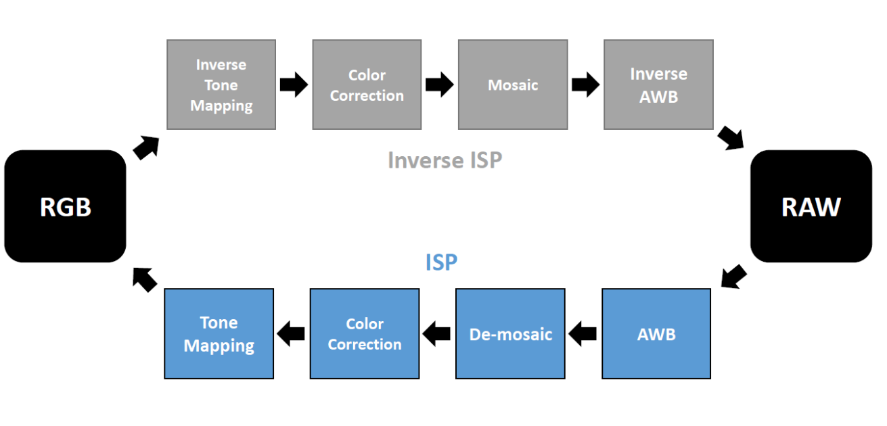

# Image Sensing Pipeline - 電腦視覺作業一

智能系統研究所 蒲品憶 313581038

# report

report/report.pdf

## Installation

Install the required packages.

    ```
    python3 -m venv venv
    cd venv/Scripts
    activate.bat
    Follow requirements.txt to install packages
    ```
    


run: python `script/implementation.ipynb` 

## Implementation 
