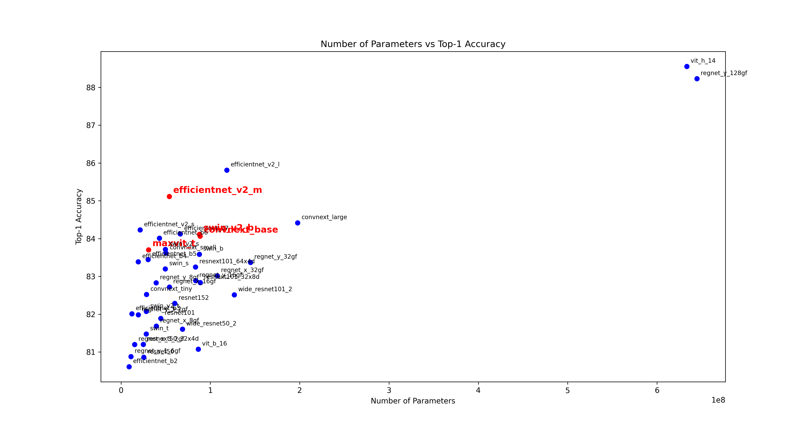

# classification_辛普森家庭 - 機器學習作業二

**智能系統研究所 蒲品憶 313581038**

## 作業連結:
* 傳送門: https://www.kaggle.com/competitions/nycu-iaii-ml-2024-classification

## report:
* 辛普森家庭_classification_report.pdf
* repoet 資料夾 (涵蓋混淆矩陣圖片/filter圖片/每個模型每次epoch的Loss值等等資料)

## pre-trained model 選擇

## 參考資料:
* https://pytorch.org/vision/stable/models.html
* https://pytorch.org/vision/master/auto_examples/transforms/plot_transforms_illustrations.html#sphx-glr-auto-examples-transforms-plot-transforms-illustrations-py

 